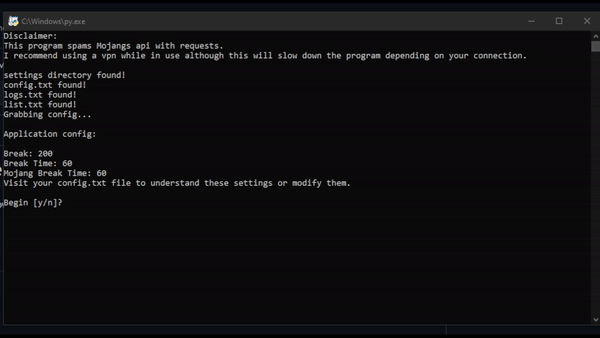

# MC Name Checker
`mcnamechecker` allows you to check the availability of several mc names in seconds. This tool can be used to find "OG" names.



Contents
========

 * [Requirements](#requirements)
 * [Features](#features)
 * [Installation](#installation)
 * [Setup](#setup)
 * [Usage](#usage)
 * [To-Do](#to-do)
 * [Credit](#credit)

### Requirements
---
To use this program you will require [`python`](https://www.python.org/) 3.9 or higher

### Features
---
- Modifiable config
- Clean UI
- Extremely easy to use
- All successful attempts are immediately saved to a `logs.txt` file
- All files will remake themselves if deleted

### Installation
---

Install with [`git`](https://git-scm.com/)
```
$ git clone https://github.com/tilas0/mcnamechecker.git
$ cd mcnamechecker
$ pip install -r requirements.txt
$ python3 main.py
```
### Setup
---
* Put your names in list.txt and ensure `they are all on seperate lines`.
* You can edit several configuration settings in `config.txt`.

### Usage
---
- This software is mainly intended for the use of getting "OG" names
- Run `main.py` after the installation and setup are complete to begin use.

### To-Do
---
- estimated time left function

### Credit
---
- Inspiration: [`This video by xinabox`](https://youtu.be/ksK41vwBUUA)

### License
---
Licensed under the [MIT License](LICENSE)